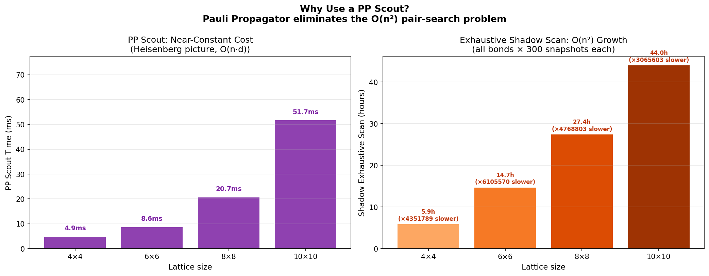
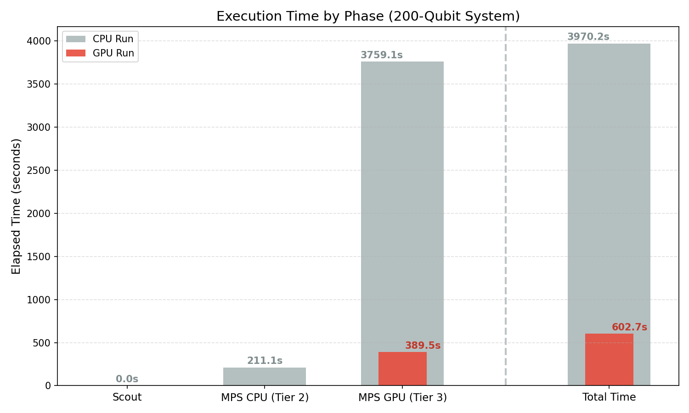

# Maestro Examples

Example simulations demonstrating quantum simulation capabilities with the [Maestro](https://github.com/QoroQuantum/maestro) high-performance quantum circuit simulator.

## Table of Contents

1. [Rydberg Atom Simulation](#1-rydberg-atom-simulation) — Phase diagram and spatial correlations of a 64-atom array
2. [Classical Shadows](#2-classical-shadows) — Entanglement detection via PP Scout → MPS Sniper pipeline
3. [Fermi-Hubbard Model](#3-fermi-hubbard-model) — Adaptive 3-tier simulation exploiting Lieb-Robinson bounds

## Getting Started

```bash
pip install -r requirements.txt
```

Or install the core dependency directly:

```bash
pip install qoro-maestro
```

Each example directory includes its own README with detailed instructions.

## Examples

### 1. [Rydberg Atom Simulation](./rydberg_atom_simulation)

Simulates the adiabatic preparation of a Z2-ordered phase in a 1D Rydberg atom array. Sweeps over detuning and Rabi frequency to map the quantum phase diagram, then measures spatial correlations to confirm long-range crystalline order.

**Key Features:**
- 64-qubit MPS simulation of Rydberg blockade physics
- Phase diagram sweep with Z2 staggered magnetization order parameter
- Spatial correlation measurement via MPS bitstring sampling
- Comparison of `estimate()` (noise-free) vs `execute()` (sampling) modes

**Scripts:**
- `rydberg_demo.py` — Phase diagram sweep → `rydberg_phase_diagram.png`
- `rydberg_correlations.py` — Correlation function → `rydberg_correlations.png`

📓 **[Interactive notebook](./rydberg_atom_simulation/rydberg_atom_simulation.ipynb)** — step-by-step tutorial

---

### 2. [Classical Shadows](./classical_shadows)

Detects quantum entanglement using classical shadows ([Huang et al., 2020](https://arxiv.org/abs/2002.08953)) with a multi-backend pipeline. The Pauli Propagator scouts the lattice in milliseconds to find entanglement hotspots, then the MPS backend runs the expensive shadow protocol only where it matters.

**Key Features:**
- Pauli Propagator as a fast entanglement scout (Heisenberg picture, O(n·d))
- MPS as a precision sniper for targeted shadow estimation (Schrödinger picture)
- T-gate injection demonstrating Clifford → non-Clifford backend transition
- Adaptive bond dimension handoff (CPU χ=16 → GPU χ=64)
- Hot vs cold subsystem comparison validating the scout's predictions
- Exact ED reference for small systems (≤20 qubits)

**Scripts:**
- `classical_shadows_demo.py` — Full 6-act showcase → `energy_evolution.png`, `entanglement_growth.png`, `lattice_heatmap.png`
- `helpers.py` — Reusable library: config, circuits, scout, shadow reconstruction, plotting

📓 **[Interactive notebook](./classical_shadows/classical_shadows.ipynb)** — step-by-step tutorial

```bash
# Quick test (4×4 = 16 qubits, ~2 min)
python classical_shadows_demo.py --small

# Full run (6×6 = 36 qubits)
python classical_shadows_demo.py

# With GPU acceleration
python classical_shadows_demo.py --gpu
```

#### Results

The classical shadows algorithm constructs an approximation of the quantum state from single samples. Classical shadows reconstruct a quantum state from single measurements, allowing for successively calculating indefinitely many expectation values in post-processing after a limited number of runs in quantum hardware.

With appropriately high precision parameters, the simulation succeeds in identifying the "hot" (high-entropy) qubits:


#### Performance notes

From the perspective of classical simulation, classical shadowing is inefficient due to the fact that classical states, unlike quantum states, can be copied and measured without loss of information. This experiment illustrates the validity of the classical shadow algorithm, but classical expectation value computation methods such as Pauli propagation or MPS remain more efficient.

The inefficiency of the classical shadow algorithm on classical hardware is made more apparent when sampling on GPUs, due to high memory transfer overheads.

Pauli propagation vs classical shadowing cost, CPU:


Pauli propagation vs classical shadowing cost, GPU



---

### 3. [Fermi-Hubbard Model](./fermi_hubbard)

Adaptive simulation of the 1D Fermi-Hubbard model — a fundamental model of strongly correlated electrons. Exploits the Lieb-Robinson bound: after a local quench, information propagates at finite speed, so most of the system remains frozen. A 200-qubit system is reduced to ~40 active qubits.

**Key Features:**
- 3-tier adaptive pipeline: PP Scout → MPS Sniper (χ=64) → Precision (χ=256)
- Clifford-only Pauli Propagator for light-cone detection on the full system
- Jordan-Wigner mapping with nearest-neighbor hopping (no JW strings)
- Domain-wall quench dynamics with charge transport visualization
- Scaling sweep demonstrating constant MPS cost regardless of total system size
- GPU acceleration for the precision tier

**Scripts:**
- `fermi_hubbard_demo.py` — Full pipeline → `adaptive_hubbard_density.png`, `adaptive_hubbard_scaling.png`
- `model.py` — `FermiHubbardModel` class for circuit construction

📓 **[Interactive notebook](./fermi_hubbard/fermi_hubbard.ipynb)** — step-by-step tutorial

```bash
# Default run (CPU only)
python fermi_hubbard_demo.py

# With GPU precision tier
python fermi_hubbard_demo.py --gpu

# Include scaling sweep across system sizes
python fermi_hubbard_demo.py --scaling
```
#### Results

The experiment showcases the fact that physically interesting behaviour is confined to a relatively small region, with all other sites being either completely full or completely empty. The Pauli propagation scout provides a first rough pass, which determines which sites are frozen and excludes them from further, costlier simulation steps, as their dynamics are known. After that, we run MPS simulation with tunable maximum bond dimension to characterize the active region around the domain wall to the required precision.


This experiment highlights the speed and scaling advantage of Pauli propagation compared to MPS simulation or state reconstruction using classical shadows. While classical shadows allow for acccesing the properties of the uncollapsed quantum state when using hardware, estimation algorithms remain competitive in simulation.

#### Performance notes

Using the GPU simulator for the high-maximum bond dimension precision simulation provides a ~10x speedup over running on just CPUs. Furthermore, since this costly precision step dominates total pipeline time, the whole experiment can be completed in significantly less time.



## Maestro Features Demonstrated

| Feature | API | Examples |
|---------|-----|----------|
| Pauli Propagator | `SimulationType.PauliPropagator` | Classical Shadows (Act 1), Fermi-Hubbard (Tier 1) |
| Matrix Product State | `SimulationType.MatrixProductState` | All examples |
| Bond dimension control | `max_bond_dimension=χ` | Classical Shadows (Acts 3, 6), Fermi-Hubbard (Tiers 2, 3) |
| Expectation values | `qc.estimate(observables=...)` | Rydberg (phase diagram), Classical Shadows, Fermi-Hubbard |
| Bitstring sampling | `qc.execute(shots=N)` | Rydberg (correlations), Classical Shadows (Act 5) |
| GPU acceleration | `SimulatorType.Gpu` | Classical Shadows, Fermi-Hubbard |

## License

See [LICENSE](./LICENSE) for details.
