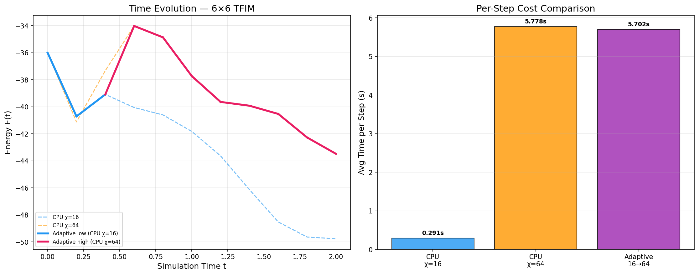

# Adaptive Bond Dimension: CPU↔GPU Handoff

## Why This Matters

MPS simulations control accuracy via **bond dimension** $\chi$. Higher $\chi$ captures more entanglement but costs more — tensor contractions scale as $O(\chi^3)$.

The key insight: **entanglement grows during time evolution**. Early time steps need only low $\chi$ (fast, CPU is fine). Later steps need high $\chi$ to maintain accuracy — and that's where **GPU acceleration pays off**.

Maestro makes switching between CPU and GPU backends trivial: change one argument, no code rewrite needed.

## What This Example Demonstrates

1. **Low χ on CPU** — fast but loses accuracy as entanglement grows
2. **High χ on CPU** — accurate but slow ($\sim 20\times$ per-step cost)
3. **High χ on GPU** — accurate AND fast (GPU parallelism wins for large tensor contractions)
4. **Adaptive** — start at low χ (CPU), automatically switch to high χ (GPU) when the energy change signals growing entanglement

## Code Structure

| File | Purpose |
|------|---------|
| `adaptive_mps.py` | Main script: runs all four configurations and compares |

## Usage

```bash
# CPU only (compares low-χ vs high-χ)
python adaptive_mps.py

# With GPU acceleration (shows the full CPU→GPU handoff)
python adaptive_mps.py --gpu

# Larger system (8×8 = 64 qubits)
python adaptive_mps.py --large

# Large system with GPU
python adaptive_mps.py --large --gpu
```

## Output

- **`adaptive_comparison.png`** — Energy evolution and per-step cost comparison across all configurations



## How the Handoff Works

```python
# Low-χ on CPU (fast, approximate)
result = qc.estimate(
    simulator_type=maestro.SimulatorType.QCSim,          # CPU
    simulation_type=maestro.SimulationType.MatrixProductState,
    max_bond_dimension=16,
)

# High-χ on GPU (accurate, GPU-accelerated)
result = qc.estimate(
    simulator_type=maestro.SimulatorType.CuQuantum,      # GPU
    simulation_type=maestro.SimulationType.MatrixProductState,
    max_bond_dimension=64,
)
```

Same API, same code — just change `simulator_type` and `max_bond_dimension`. Maestro handles the backend switch transparently.

## Key Maestro Features Used

| Feature | API | Purpose |
|---------|-----|---------|
| MPS Simulation | `SimulationType.MatrixProductState` | Core simulation method |
| Bond dimension | `max_bond_dimension=χ` | Accuracy vs speed control |
| CPU backend | `SimulatorType.QCSim` | Fast at low χ |
| GPU backend | `SimulatorType.CuQuantum` | Fast at high χ |
| Expectation values | `qc.estimate(observables=...)` | Energy monitoring |

## Requirements

- `qoro-maestro` Python package
- `numpy`
- `matplotlib`
- NVIDIA GPU + cuQuantum (for `--gpu` mode)
