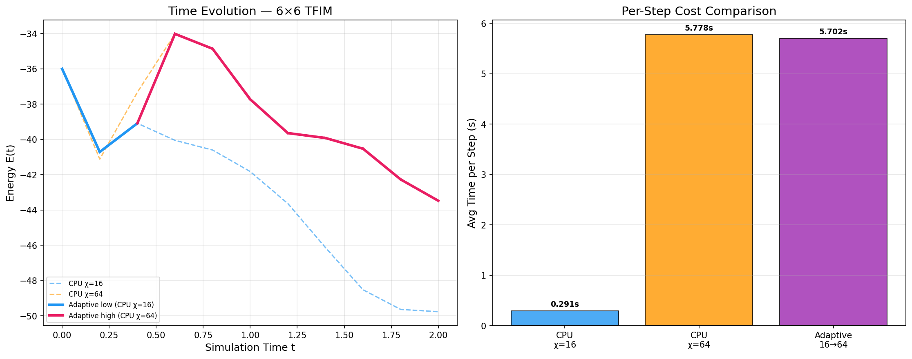

# Adaptive Bond Dimension: CPU↔GPU Handoff

> 🚀 **Try Maestro GPU mode with a free trial.**
> Sign up at **[maestro.qoroquantum.net](https://maestro.qoroquantum.net)** — no credit card required.

## Why GPU Mode?

MPS accuracy is controlled by **bond dimension** χ. Higher χ captures more entanglement but costs **O(χ³)** per step. On CPU, the runtime grows rapidly — going from χ=16 to χ=64 is a **64× cost increase**. GPU parallelism absorbs this cost, making high-χ simulation practical.

The pitch: **Maestro lets you switch backends with one argument.** No code rewrite, no separate GPU code paths. Same API, GPU speed.

## What It Does

Demonstrates how trivially Maestro switches between CPU and GPU backends during MPS time evolution. Compares four configurations side-by-side to show where GPU acceleration pays off:

1. **Low χ on CPU** — fast but loses accuracy as entanglement grows
2. **High χ on CPU** — accurate but slow (~20× per-step cost)
3. **High χ on GPU** — accurate AND fast
4. **Adaptive** — starts at low χ (CPU), automatically switches to high χ (GPU) when entanglement demands it

### Phase 1 — Local (CPU)

Compare low-χ vs high-χ on CPU. See exactly where accuracy degrades and how much extra time high-χ costs on CPU.

### Phase 2 — GPU Mode

Add GPU to the comparison. Watch the high-χ GPU configuration match CPU accuracy at a fraction of the time. The adaptive mode shows the optimal strategy: cheap CPU steps early, GPU power when it matters.

```bash
# Phase 1: CPU only (compare bond dimensions)
python adaptive_mps.py

# Phase 2: Full CPU↔GPU comparison
python adaptive_mps.py --gpu

# Larger system (8×8 = 64 qubits)
python adaptive_mps.py --large --gpu
```

## The One-Line Switch

```python
# Low-χ on CPU (fast, approximate)
result = qc.estimate(
    simulator_type=maestro.SimulatorType.QCSim,          # CPU
    simulation_type=maestro.SimulationType.MatrixProductState,
    max_bond_dimension=16,
)

# High-χ on GPU (accurate, GPU-accelerated)
result = qc.estimate(
    simulator_type=maestro.SimulatorType.Gpu,      # GPU
    simulation_type=maestro.SimulationType.MatrixProductState,
    max_bond_dimension=64,
)
```

Same API. Same code. Just change `simulator_type` and `max_bond_dimension`.

📓 **[Interactive notebook](./adaptive_bond_dimension.ipynb)** — step-by-step tutorial

## Expected Output

**`adaptive_comparison.png`** — Energy evolution and per-step cost comparison across all four configurations. Shows where GPU acceleration becomes essential.



## Configuration

| Parameter | Default | Large |
|-----------|---------|-------|
| Qubits | 16 | 64 (8×8) |
| Low χ | 16 | 16 |
| High χ | 64 | 64 |
| Trotter steps | 20 | 20 |

---

👉 **Ready for high-χ at GPU speed?** [Start your free GPU trial](https://maestro.qoroquantum.net) and run with `--gpu`.
