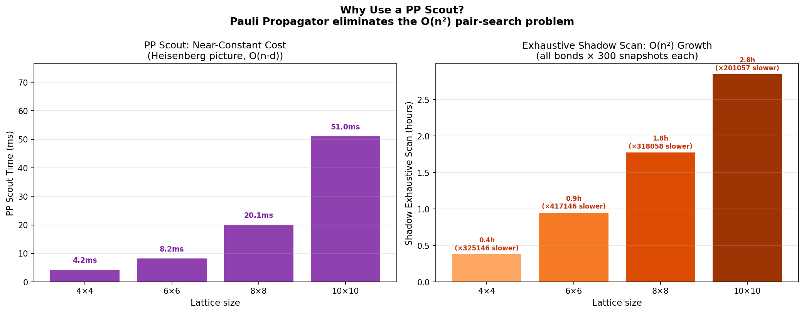

# Classical Shadows: PP Scout → MPS Sniper

## Why This Problem Matters

**Entanglement entropy** quantifies genuine quantum correlations but requires exponentially many measurements via full tomography. **Classical Shadows** ([Huang et al., 2020](https://arxiv.org/abs/2002.08953)) reduce this to $O(\log n / \varepsilon^2)$ samples — but you still need to choose *which subsystem* to measure.

This showcase uses Maestro's **Pauli Propagator as a scout** to cheaply identify where entanglement concentrates on the lattice, then deploys the **MPS backend as a sniper** — running the expensive classical shadows protocol only on the most promising subsystem.

## Code Structure

| File | Purpose |
|------|---------|
| `helpers.py` | Reusable functions: `Config` dataclass, circuit builders, scout, shadow estimation, plotting |
| `classical_shadows_demo.py` | Showcase script: PP Scout (Act 1) → MPS Sniper (Acts 2–6) |

## The Six Acts

### Act 1: PP Scout — Scanning the Lattice

**Backend:** `PauliPropagator` · **Cost:** O(n·d), no wavefunction

Builds a TFIM Trotter circuit and computes `⟨Z_i Z_j⟩` for every nearest-neighbor bond on a 2D lattice. Bonds are ranked by a coordination-weighted entanglement score.

**Why PP:** The Pauli Propagator works in the Heisenberg picture — tracking operators backward through the circuit. For Clifford-like operations, a Pauli maps efficiently, so the cost is $O(n \cdot d)$ regardless of system size. A statevector would need $2^n$ amplitudes. PP scans all bonds in milliseconds.

**Output:** `HOT` subsystem (strongest `|⟨ZZ⟩|`) and `COLD` subsystem (weakest) for comparison.

---

### Act 2: The Breaking Point — T-Gate Magic

**Backend:** `MatrixProductState`

Injects T-gates into the TFIM circuit. Each T-gate causes Pauli branching ($T^\dagger X T = (X+Y)/\sqrt{2}$), making PP exponentially expensive. Maestro switches to MPS (Schrödinger picture).

**Why MPS:** After $k$ T-gates, PP would need to track $2^k$ Pauli terms. MPS simulates the full state explicitly, with cost controlled by bond dimension $\chi$.

---

### Act 3: Adaptive Bond Dimension (CPU → GPU)

**Backend:** MPS with $\chi_{\text{low}} \to \chi_{\text{high}}$

Time-evolves the TFIM, upgrading $\chi$ when entanglement exceeds a threshold. With `--gpu`, the high-bond stage uses GPU-accelerated tensor contractions.

**Why adaptive $\chi$:** Tensor contraction costs $O(\chi^3)$. Starting at $\chi=16$ and upgrading to $\chi=64$ only when needed avoids 64× overhead during early time steps.

---

### Act 4: Random Clifford Layer

**Backend:** Classical (O(1) per qubit)

Applies random single-qubit Cliffords for tomographic completeness. The inverse channel $U_i^\dagger Z U_i$ is computed classically via Pauli propagation.

---

### Act 5: Bitstring Sampling

**Backend:** MPS `execute(shots=N)`

Switches from deterministic `estimate()` to stochastic `execute()`, emulating quantum hardware readout. MPS samples bitstrings efficiently via sequential conditional probabilities.

---

### Act 6: MPS Sniper — Hot vs Cold Comparison

**Backend:** MPS + NumPy post-processing

Runs the full classical shadows protocol on **both** the PP-scouted hot subsystem and the cold subsystem. Side-by-side comparison validates whether the scout correctly identified the entanglement hotspot.

**At 36 qubits:** Exact ED is impossible ($2^{36}$ amplitudes). Classical shadows use 200 snapshots vs $4^{36} \approx 4.7 \times 10^{21}$ full tomography measurements — a $10^{19}\times$ speedup.

## Usage

```bash
# Default: 6×6 = 36 qubits
python classical_shadows_demo.py

# GPU acceleration
python classical_shadows_demo.py --gpu

# Quick test: 4×4 = 16 qubits + exact ED reference (~2 min)
python classical_shadows_demo.py --small
```

## Output

- **`energy_evolution.png`** — $E(t)$ with backend handoff annotated
- **`entanglement_growth.png`** — S₂ comparison: PP-scouted hot vs cold subsystem, with exact ED reference (when ≤20 qubits)
- **`lattice_heatmap.png`** — 2D lattice with bond entanglement scores

## Results

The classical shadows algorithm constructs an approximation of the quantum state from single samples. Classical shadows reconstruct a quantum state from single measurements, allowing for successively calculating indefinitely many expectation values in post-processing after a limited number of runs in quantum hardware.

With appropriately high precision parameters, the simulation succeeds in identifying the "hot" (high-entropy) qubits:


### Performance notes

From the perspective of classical simulation, classical shadowing is inefficient due to the fact that classical states, unlike quantum states, can be copied and measured without loss of information. This experiment illustrates the validity of the classical shadow algorithm, but classical expectation value computation methods such as Pauli propagation or MPS remain more efficient.

The inefficiency of the classical shadow algorithm on classical hardware is made more apparent when sampling on GPUs, due to high memory transfer overheads.

Pauli propagation vs classical shadowing cost, CPU:


Pauli propagation vs classical shadowing cost, GPU


## Key Maestro Features Used

| Feature | API | Where Used |
|---------|-----|------------|
| Pauli Propagator | `SimulationType.PauliPropagator` | Act 1 (scout) |
| MPS Simulation | `SimulationType.MatrixProductState` | Acts 2, 3, 5, 6 |
| Adaptive bond dimension | `max_bond_dimension=16 → 64` | Act 3 |
| Deterministic estimates | `qc.estimate(observables=...)` | Acts 1–3 |
| Stochastic sampling | `qc.execute(shots=N)` | Acts 5–6 |
| GPU acceleration | `SimulatorType.Gpu` | Acts 3, 5, 6 with `--gpu` |

## Requirements

- `qoro-maestro` Python package
- `numpy`
- `matplotlib`
