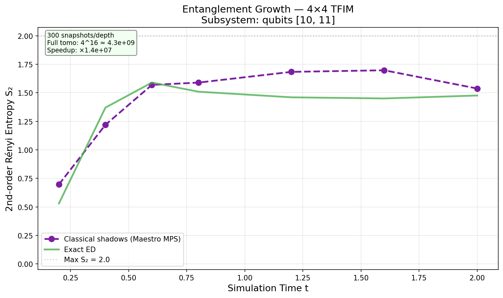

# Classical Shadows: Entanglement Detection via MPS

> 🚀 **Try Maestro GPU mode with a free trial.**
> Sign up at **[maestro.qoroquantum.net](https://maestro.qoroquantum.net)** — no credit card required.

## Why GPU Mode?

The classical shadows protocol needs **hundreds of independent MPS snapshots** — each one a full simulation (`execute(shots=1)`). At 36 qubits, that's hundreds of MPS runs in sequence. GPU-accelerated MPS cuts per-snapshot time dramatically, making large-scale shadow tomography practical instead of painful.

At 36 qubits, full tomography needs **4³⁶ ≈ 4.7 × 10²¹ measurements**. Classical shadows use just 200 snapshots — but those snapshots still need a fast simulator.

## What It Does

Estimates **entanglement entropy** using the classical shadows protocol ([Huang et al., 2020](https://arxiv.org/abs/2002.08953)) with Maestro's MPS backend. Tracks how the 2nd Rényi entropy S₂ grows during Trotter evolution of the transverse-field Ising model on a 2D lattice.

**Protocol:** Prepare state → apply random Cliffords → measure → reconstruct shadow → repeat M times → estimate S₂.

### Phase 1 — Local (CPU)

4×4 = 16 qubits with exact ED reference. Runs in ~2 minutes. Proves the shadow protocol works and tracks entanglement growth.

### Phase 2 — GPU Mode

6×6 = 36 qubits — well beyond exact diagonalization. GPU mode accelerates each of the hundreds of shadow snapshots.

```bash
# Phase 1: Quick test (16 qubits, CPU, ~2 min)
python classical_shadows_demo.py --small

# Phase 1: Full run (36 qubits, CPU)
python classical_shadows_demo.py

# Phase 2: GPU-accelerated shadows
python classical_shadows_demo.py --gpu
```

## Code Structure

| File | Purpose |
|------|---------|
| `helpers.py` | Reusable library: config, circuits, shadow reconstruction |
| `classical_shadows_demo.py` | Main script: sweep Trotter depths, estimate S₂ |

📓 **[Interactive notebook](./classical_shadows.ipynb)** — step-by-step tutorial

## Expected Output

**`entanglement_growth.png`** — S₂ vs simulation time. Shadow estimates track the exact entanglement growth curve, showing how entanglement develops during Trotter evolution.



## Configuration

| Parameter | Default |
|-----------|---------|
| Qubits | 16 (small) / 36 (full) |
| Bond dim χ | 16–32 |
| Shadows | 200 |
| Trotter depths | Multiple |

---

👉 **Ready for larger systems?** [Start your free GPU trial](https://maestro.qoroquantum.net) and accelerate shadow collection with `--gpu`.
