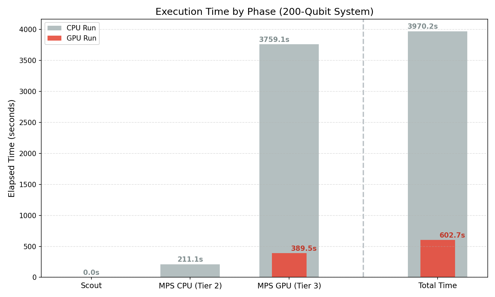
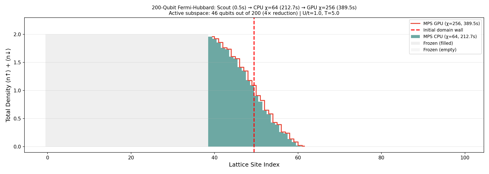

# Fermi-Hubbard Model: Adaptive Simulation Pipeline

> 🚀 **Try Maestro GPU mode with a free trial.**
> Sign up at **[maestro.qoroquantum.net](https://maestro.qoroquantum.net)** — no credit card required.

## Why GPU Mode?

The adaptive pipeline's **precision tier** (χ=256) dominates total runtime — and MPS tensor contractions scale as **O(χ³)**. On CPU, the precision step alone can take hours. GPU acceleration provides a **~10× speedup** on this bottleneck, collapsing the whole pipeline from hours to minutes.



## What It Does

Simulates a **200-qubit 1D Fermi-Hubbard system** — a fundamental model of strongly correlated electrons. The key insight: after a domain-wall quench, information propagates at a finite **Lieb-Robinson velocity**, creating a causal light cone. Most of the system stays frozen, so a 200-qubit problem reduces to **~40 active qubits**.

The 3-tier adaptive pipeline exploits this:

1. **Scout** (Pauli Propagator) — Clifford-only proxy on the full system to detect the active region. Seconds.
2. **Sniper** (MPS CPU, χ=64) — Real Trotter circuit on just the active subregion. Fast, approximate.
3. **Precision** (MPS GPU, χ=256) — High bond dimension for converged results. **This is where GPU pays off.**

### Phase 1 — Local (CPU)

200-qubit system, all three tiers on CPU. The scout and sniper tiers are fast. The precision tier is the bottleneck — but it proves the pipeline works.

### Phase 2 — GPU Mode

Same pipeline, but the precision tier runs on GPU. The **~10× speedup** on the O(χ³) contractions means the precision step no longer dominates — the whole experiment finishes in minutes.

```bash
# Phase 1: CPU only
python fermi_hubbard_demo.py

# Phase 2: GPU precision tier
python fermi_hubbard_demo.py --gpu

# Include scaling sweep across system sizes
python fermi_hubbard_demo.py --scaling
```

## Code Structure

| File | Purpose |
|------|---------|
| `model.py` | `FermiHubbardModel` class — circuit construction for Trotter evolution and Clifford scout |
| `fermi_hubbard_demo.py` | 3-tier pipeline: Scout → Sniper → Precision, with visualization |

📓 **[Interactive notebook](./fermi_hubbard.ipynb)** — step-by-step tutorial

## Expected Output

**`adaptive_hubbard_density.png`** — Particle density profile showing domain wall spreading. Active vs frozen regions highlighted — most of the 200-qubit system stays frozen.



**`adaptive_hubbard_scaling.png`** — Wall-clock time vs system size. MPS time stays constant (light cone is fixed) while only the scout time grows linearly.

## Configuration

| Parameter | Default |
|-----------|---------|
| System size | 200 qubits (100 sites × 2 spins) |
| Scout | Pauli Propagator (full system) |
| Sniper χ | 64 |
| Precision χ | 256 |
| Hopping t | 1.0 |
| Interaction U | 4.0 |

---

👉 **Ready for GPU-accelerated precision?** [Start your free GPU trial](https://maestro.qoroquantum.net) and run with `--gpu`.
